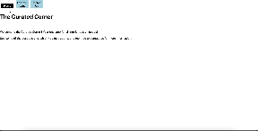

# Name - The Curated Corner

## Description

A single page application designed using React.js and CSS. Upon opening, users see the homepage of the website and the inital information explaining it. Then, users can navigate to the favorite items page which show the favorite items of the Curated Corner staff with a name, price, and image of the item. Additionally, if the user has any favorite items they want to add, they may be submitted via a form and an addition to the list is created. Finally, a user may submit their phone number and email address for future contact purposes.

## Usage

API used: local db.json file 

## Acknowledgements

I would like to thank all of the Flatiron phase leaders, technical coaches, fellow students, and all others not mentioned here but who were extremely influential for all your help reaching this milestone. It could not have been done without you. 

## Project Status

 This project is currently under development.